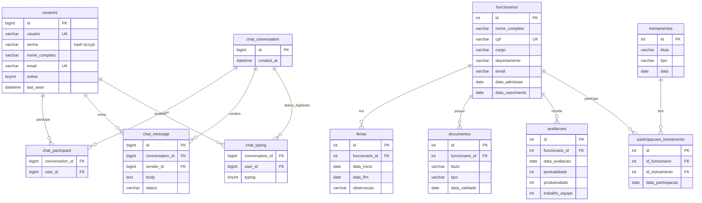

# Banco de Dados — Wayne Enterprises (`wayne_db`)
### Análise profunda do schema

---

## 1. Diagrama ER



**Tabelas sem relacionamento de FK hoje** (isoladas, cada uma referenciada só pelo código, não pelo banco): `cargos`, `beneficios`, `equipamentos`, `avisos`, `chamados`, `notificacoes`, `notificacao_tipo`, `log_acoes`, `log_auditoria`, `curriculos`, `processos_seletivos`, `candidatos`, `eventos`, `eventos_corporativos`, `empresa_info`. Isso não é um erro por si só — nem toda tabela precisa de FK — mas várias delas *deveriam* ter uma referência real e hoje não têm (ver seção 3).

---

## 2. Inventário completo (26 tabelas)

| Tabela | Linhas esperadas | PK | FKs | Observação |
|---|---|---|---|---|
| `usuarios` | baixo volume (equipe interna) | `id` | — | login do sistema |
| `funcionarios` | médio | `id` | — | tabela central do RH |
| `ferias` | médio/alto | `id` | `funcionario_id` | 1:N com funcionário |
| `documentos` | médio/alto | `id` | `funcionario_id` | 1:N com funcionário |
| `avaliacoes` | médio/alto | `id` | `funcionario_id` | 1:N com funcionário |
| `cargos` | baixo | `id` | — | sem FK de `funcionarios.cargo` (ver 3.1) |
| `beneficios` | baixo | `id` | — | sem FK associando a funcionário |
| `equipamentos` | médio | `id` | — | `funcionario_responsavel` é texto livre (ver 3.2) |
| `avisos` | baixo | `id` | — | mural |
| `chamados` | médio | `id` | — | `funcionario` é texto livre, `data_abertura` é VARCHAR (ver 3.3) |
| `notificacoes` | alto (cresce rápido) | `id` | — | sem paginação/limpeza automática hoje |
| `notificacao_tipo` | baixo | `id` | — | tabela de domínio (ok) |
| `log_acoes` | alto | `id` | — | duplica `log_auditoria` (ver 3.4) |
| `log_auditoria` | alto | `id` | — | duplica `log_acoes` |
| `curriculos` | médio | `id` | — | recrutamento |
| `processos_seletivos` | baixo | `id` | — | sem FK para `candidatos` (ver 3.5) |
| `candidatos` | médio | `id` | — | sem FK para `processos_seletivos` |
| `treinamentos` | baixo | `id` | — | — |
| `participacoes_treinamento` | médio/alto | `id` | `id_funcionario`, `id_treinamento` | tabela associativa correta |
| `eventos` | baixo | `id` | — | usada por `EventoDAO` |
| `eventos_corporativos` | baixo | `id` | — | usada por `AgendaCorporativaDAO`/`EventoCorporativoDAO` |
| `empresa_info` | 1 linha (singleton) | `id` fixo=1 | — | `CHECK (id=1)` garante linha única |
| `chat_conversation` | médio | `id` | — | — |
| `chat_participant` | médio/alto | composta | `conversation_id`, `user_id` | associativa correta |
| `chat_message` | alto | `id` | `conversation_id`, `sender_id` | — |
| `chat_typing` | baixo (efêmero) | composta | `conversation_id`, `user_id` | estado transitório, ok |

---

## 3. Pontos de atenção reais (achados na modelagem, não só no código)

### 3.1 `funcionarios.cargo` e `funcionarios.departamento` são texto livre, não FK para `cargos`
Existe uma tabela `cargos` com `nome`, `salario_base`, `nivel` — mas `funcionarios.cargo` é um `VARCHAR` solto, sem ligação com ela. Na prática isso significa que alguém pode digitar "Anaista Financeiro" (erro de digitação) num funcionário e o sistema nunca vai notar que isso não bate com nenhum cargo cadastrado. Isso também é a causa raiz de `contarCargos()`/`setorComMaisFuncionarios()` (vistos no `FuncionarioDAOMethods`) agruparem por texto — dois funcionários com "TI" e "T.I." viram grupos diferentes nos relatórios.
**Ideal:** `funcionarios.cargo_id INT FK -> cargos.id`. É uma mudança de médio risco (precisa migrar dados existentes), então deixei fora do `schema.sql` atual — é candidata pra quando vocês forem mexer na Fase de duplicações/consolidação.

### 3.2 `equipamentos.funcionario_responsavel` guarda nome, não ID
Mesmo problema do item acima: se um funcionário mudar de nome ou for excluído, o vínculo se perde e não há como fazer `JOIN` confiável entre equipamento e funcionário.

### 3.3 `chamados.data_abertura` é `VARCHAR`, não `DATE`/`DATETIME`
Isso não foi decisão minha — é o que o código Java já espera hoje (`Chamado.getDataAbertura()` retorna `String`). Mantive assim no schema pra não quebrar nada, mas isso impede ordenar chamados por data de forma confiável no SQL (`ORDER BY data_abertura` ordena como texto, não como data — "2/1/2026" vem antes de "10/1/2026" alfabeticamente). Vale corrigir o tipo no Java e migrar a coluna junto, quando chegar a vez dessa tela.

### 3.4 `log_acoes` e `log_auditoria` — duas tabelas de log fazendo quase a mesma coisa
`log_acoes(usuario, acao, momento)` vs `log_auditoria(usuario, acao, modulo, data_hora)`. A única diferença real é a coluna `modulo`. Isso sugere que em algum momento alguém criou uma segunda tabela em vez de adicionar uma coluna na primeira. Não deletei nenhuma das duas agora (para não perder histórico de log já gravado), mas o caminho recomendado é: adicionar `modulo` em `log_acoes`, migrar os dados de `log_auditoria` pra lá, e aposentar `log_auditoria`.

### 3.5 `candidatos` e `processos_seletivos` não se conversam
Existem as duas tabelas, mas nenhuma tem uma FK ligando um candidato a um processo seletivo específico. Hoje, no código, elas são gerenciadas de forma totalmente independente. Se a intenção é candidato se inscrever em um processo, falta uma tabela associativa (`candidato_id`, `processo_seletivo_id`) — ou, no mínimo, `candidatos.processo_seletivo_id`.

### 3.6 `eventos` vs `eventos_corporativos` vs o `EventoCalendarioDAO` quebrado
Já sinalizado no README original: `EventoCalendarioDAO` espera colunas (`data_evento`, `origem`) que não existem em nenhuma tabela real do schema atual — ele foi escrito "no chute" (o próprio comentário no código admite isso). Esse DAO vai lançar `SQLException` de coluna inexistente se for chamado hoje. Não criei uma terceira tabela pra "consertar por fora"; a correção certa é decidir se `EventoCalendarioDAO` deveria apontar para `eventos_corporativos` (que já tem `data_evento`) e ajustar o DAO, ou deletá-lo se for redundante com `AgendaCorporativaDAO`.

### 3.7 Falta soft-delete / auditoria de quem alterou o quê
Nenhuma tabela tem `criado_em`/`atualizado_em`/`deletado_em`. Hoje, um `DELETE` é definitivo e não há registro de quem excluiu o quê (fora do log genérico de ações). Para um sistema de RH isso importa — dados de funcionário, férias, avaliações costumam precisar de histórico. Não é urgente, mas vale considerar antes de colocar em uso real com dados de pessoas de verdade.

---

## 4. Normalização — está em 3FN?

De modo geral, **sim, para a maior parte das tabelas** — cada uma representa uma entidade coesa, sem repetição óbvia de grupos de dados. As exceções são justamente os pontos 3.1 e 3.2 acima (dependência transitiva escondida em texto livre em vez de FK), que tecnicamente não violam 3FN formalmente (não há repetição de coluna), mas violam o espírito da normalização ao duplicar informação que deveria vir de uma tabela de referência.

Não há nenhuma tabela com múltiplos valores numa única coluna (violação de 1FN) nem colunas que dependem só de parte de uma chave composta (violação de 2FN) — as únicas PKs compostas são `chat_participant` e `chat_typing`, e em ambas todas as colunas fazem sentido para a chave inteira.

---

## 5. Dados de teste

Pra não ficar testando telas com o banco vazio, use `seed_data.sql` (nesta mesma pasta) depois de rodar `schema.sql`. Ele popula funcionários, cargos, férias, avaliações, avisos e treinamentos fake — só dados de teste, sem CPF real, pode rodar e apagar à vontade.

```bash
mysql -u root -p wayne_db < schema.sql
mysql -u root -p wayne_db < seed_data.sql
```

## 6. Queries de sanidade

Pra verificar rapidamente se está tudo consistente depois de mexer no banco:

```sql
-- Confere se todas as FKs estão realmente batendo (não deve retornar linhas)
SELECT f.id FROM ferias f LEFT JOIN funcionarios fn ON f.funcionario_id = fn.id WHERE fn.id IS NULL;
SELECT d.id FROM documentos d LEFT JOIN funcionarios fn ON d.funcionario_id = fn.id WHERE fn.id IS NULL;
SELECT a.id FROM avaliacoes a LEFT JOIN funcionarios fn ON a.funcionario_id = fn.id WHERE fn.id IS NULL;

-- Lista as 26 tabelas esperadas de uma vez, pra conferir que nenhuma sumiu
SELECT table_name, table_rows
FROM information_schema.tables
WHERE table_schema = 'wayne_db'
ORDER BY table_name;
```

---

*Este documento complementa `schema.sql` — ele não recria nada, só explica as decisões e sinaliza o que ainda merece atenção quando vocês chegarem na fase de consolidação/duplicações do README principal.*

